# WEEK5 TASKES
本周任務是架設MySQL資料庫伺服器，進行基本SQL操作。

以下為任務紀錄。

---
### 要求三
*3-1使⽤ INSERT 指令新增⼀筆資料到 member 資料表中，這筆資料的 username 和 password 欄位必須是 test。接著繼續新增⾄少 4 筆隨意的資料。

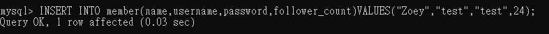

*3-2使⽤ SELECT 指令取得所有在 member 資料表中的會員資料。

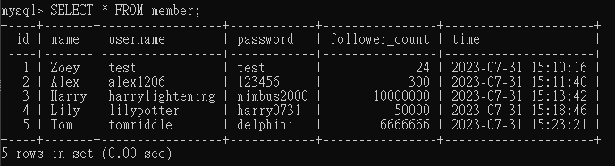

*3-3使⽤ SELECT 指令取得所有在 member 資料表中的會員資料，並按照 time 欄位，由近到遠排序。

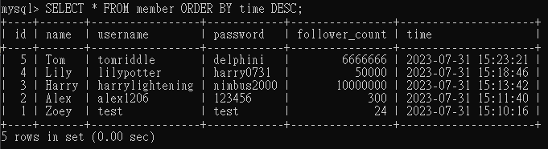

*3-4使⽤ SELECT 指令取得 member 資料表中第 2 到第 4 筆共三筆資料，並按照 time 欄位，由近到遠排序。

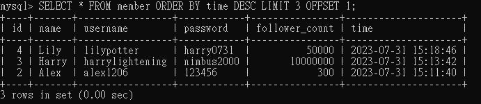

*3-5使⽤ SELECT 指令取得欄位 username 是 test 的會員資料。

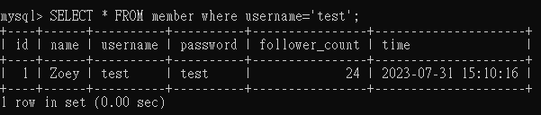

*3-6使⽤ SELECT 指令取得欄位 username 是 test、且欄位 password 也是 test 的資料。

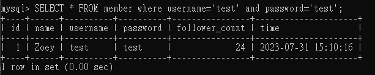

*3-7使⽤ UPDATE 指令更新欄位 username 是 test 的會員資料，將資料中的 name 欄位改成 test2。

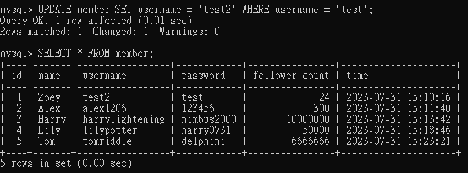

---
### 要求四：SQL Aggregate Functions

*4-1取得 member 資料表中，總共有幾筆資料 ( 幾位會員 )。

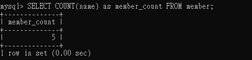

*4-2取得 member 資料表中，所有會員 follower_count 欄位的總和。

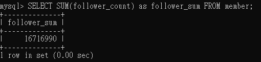

*4-3取得 member 資料表中，所有會員 follower_count 欄位的平均數。

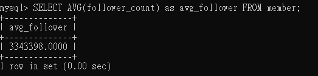

---
### 要求五
##### member table

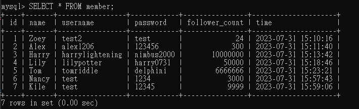

##### message table

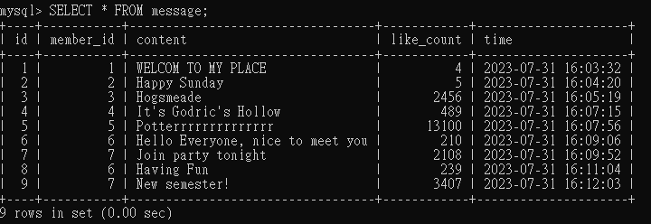

*5-1使⽤ SELECT 搭配 JOIN 語法，取得所有留⾔，結果須包含留⾔者的姓名。

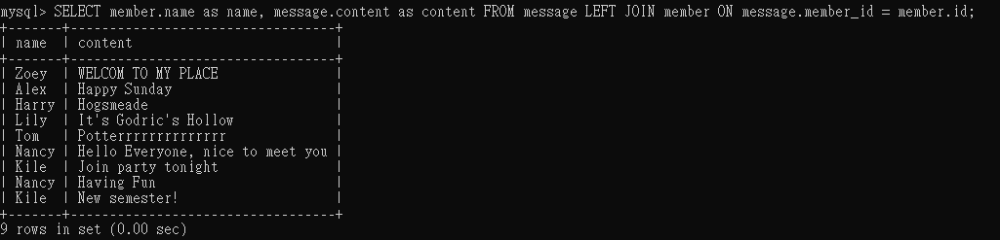

*5-2使⽤ SELECT 搭配 JOIN 語法，取得 member 資料表中欄位 username 是 test 的所有留⾔，資料中須包含留⾔者的姓名。

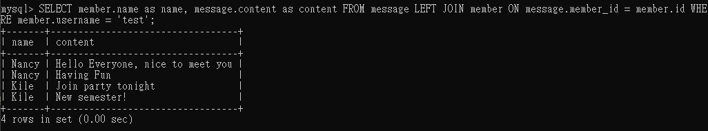

*5-3使⽤ SELECT、SQL Aggregate Functions 搭配 JOIN 語法，取得 member 資料表中欄位 username 是 test 的所有留⾔平均按讚數。

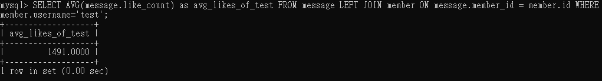